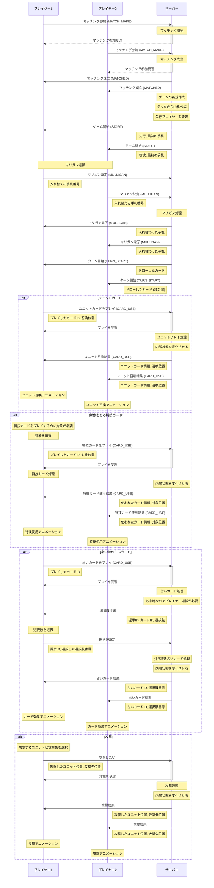

# サーバーとクライアントのやりとり

## シーケンス図

```mermaid
sequenceDiagram
participant p1 as プレイヤー1
participant p2 as プレイヤー2
participant sv as サーバー

    p1->>sv: マッチング参加 (MATCH_MAKE)
    activate sv
    Note over sv: マッチング開始
    sv-->>p1: マッチング参加受理
    deactivate sv
    p2->>sv: マッチング参加 (MATCH_MAKE)
    activate sv
    Note over sv: マッチング成立
    sv-->>p2: マッチング参加受理
    deactivate sv
    sv->>p1: マッチング成立 (MATCHED)
    sv->>p2: マッチング成立 (MATCHED)

    Note over sv: ゲームの新規作成
    Note over sv: デッキから山札作成
    Note over sv: 先行プレイヤーを決定
    sv->>p1: ゲーム開始 (START)
    Note left of sv: 先行, 最初の手札
    sv->>p2: ゲーム開始 (START)
    Note left of sv: 後攻, 最初の手札
    Note over p1, p2: マリガン選択
    p1->>sv: マリガン決定 (MULLIGAN)
    Note right of p1: 入れ替える手札番号
    p2->>sv: マリガン決定 (MULLIGAN)
    Note right of p2: 入れ替える手札番号
    Note over sv: マリガン処理
    sv->>p1: マリガン完了 (MULLIGAN)
    Note left of sv: 入れ替わった手札
    sv->>p2: マリガン完了 (MULLIGAN)
    Note left of sv: 入れ替わった手札
    sv->>p1: ターン開始 (TURN_START)
    Note left of sv: ドローしたカード
    sv->>p2: ターン開始 (TURN_START)
    Note left of sv: ドローしたカード (非公開)

    alt ユニットカード
        p1->>sv: ユニットカードをプレイ (CARD_USE)
        activate sv
        Note right of p1: プレイしたカードID, 召喚位置
        sv->>p1: プレイを受理
        deactivate sv

        Note over sv: ユニットプレイ処理
        Note over sv: 内部状態を変化させる
        sv->>p1: ユニット召喚結果 (CARD_USE)
        Note left of sv: ユニットカード情報, 召喚位置
        sv->>p2: ユニット召喚結果 (CARD_USE)
        Note left of sv: ユニットカード情報, 召喚位置
        Note over p1: ユニット召喚アニメーション
        Note over p2: ユニット召喚アニメーション
    end

    alt 対象をとる特技カード
        Note over p1: 特技カードをプレイするのに対象が必要
        Note over p1: 対象を選択
        p1->>sv: 特技カードをプレイ (CARD_USE)
        activate sv
        Note right of p1: プレイしたカードID, 対象位置
        sv->>p1: プレイを受理
        deactivate sv

        Note over p1: 特技カード処理
        Note over sv: 内部状態を変化させる
        sv->>p1: 特技カード使用結果 (CARD_USE)
        Note left of sv: 使われたカード情報, 対象位置
        sv->>p2: 特技カード使用結果 (CARD_USE)
        Note left of sv: 使われたカード情報, 対象位置
        Note over p1: 特技使用アニメーション
        Note over p2: 特技使用アニメーション
    end

    alt 必中時の占いカード
        p1->>sv: 占いカードをプレイ (CARD_USE)
        activate sv
        Note right of p1: プレイしたカードID
        sv->>p1: プレイを受理
        deactivate sv

        Note over sv: 占いカード処理
        Note over sv: 必中時なのでプレイヤー選択が必要
        sv->>p1: 選択肢提示
        Note left of sv: 提示ID, カードID, 選択肢
        Note over p1: 選択肢を選択
        p1->>sv: 選択肢決定
        Note right of p1: 提示ID, 選択した選択肢番号
        Note over sv: 引き続き占いカード処理
        Note over sv: 内部状態を変化させる
        sv->>p1: 占いカード結果
        Note left of sv: 占いカードID, 選択肢番号
        sv->>p2: 占いカード結果
        Note left of sv: 占いカードID, 選択肢番号
        Note over p1: カード効果アニメーション
        Note over p2: カード効果アニメーション
    end

    alt 攻撃
        Note over p1: 攻撃するユニットと攻撃先を選択
        p1->>sv: 攻撃したい
        activate sv
        Note right of p1: 攻撃したユニット位置, 攻撃先位置
        sv->>p1: 攻撃を受理
        deactivate sv

        Note over sv: 攻撃処理
        Note over sv: 内部状態を変化させる
        sv->>p1: 攻撃結果
        Note left of sv: 攻撃したユニット位置, 攻撃先位置
        sv->>p2: 攻撃結果
        Note left of sv: 攻撃したユニット位置, 攻撃先位置
        Note over p1: 攻撃アニメーション
        Note over p2: 攻撃アニメーション
    end


```
